# Data Model (AI)

## 1. Database Diagram

```mermaid
erDiagram
    AUTH_USER {
        bigint id PK
    }

    TAG {
        bigint id PK
        varchar_25 name
    }

    COURSE {
        bigint id PK
        varchar_75 name
        date date_created
        boolean active
    }

    BOOK {
        bigint id PK
        varchar_75 name
        bigint course_id FK
        text description
        integer index
    }

    PROJECT {
        bigint id PK
        varchar_55 name
        varchar_256 implementation_url
        varchar client_template_url
        varchar api_template_url
        bigint book_id FK
        integer index
        boolean active
        boolean is_group_project
    }

    PROJECTNOTE {
        bigint id PK
        bigint user_id FK
        bigint project_id FK
        text note
    }

    PROJECTTAG {
        bigint id PK
        bigint project_id FK
        bigint tag_id FK
    }

    PROPOSALSTATUS {
        bigint id PK
        varchar_55 status
    }

    CAPSTONE {
        bigint id PK
        bigint student_id FK
        bigint course_id FK
        varchar_256 proposal_url
        varchar_256 repo_url
        text description
    }

    CAPSTONETIMELINE {
        bigint id PK
        bigint capstone_id FK
        bigint status_id FK
        datetime date
    }

    COHORTCOURSE {
        bigint id PK
        bigint cohort_id FK
        bigint course_id FK
        boolean active
        smallint index
    }

    FOUNDATIONSEXERCISE {
        bigint id PK
        varchar_50 learner_github_id
        varchar_75 learner_name
        varchar_75 title
        varchar_75 slug
        integer attempts
        boolean complete
        datetime completed_on
        datetime first_attempt
        datetime last_attempt
        text completed_code
        boolean used_solution
    }

    FOUNDATIONSLEARNERPROFILE {
        bigint id PK
        varchar_50 learner_github_id
        varchar_75 learner_name
        varchar_15 cohort_type
        integer cohort_number
    }

    TAXONOMYLEVEL {
        bigint id PK
        varchar_20 level_name
    }

    LEARNINGOBJECTIVE {
        bigint id PK
        varchar_255 swbat
        bigint bloom_level_id FK
    }

    OBJECTIVETAG {
        bigint id PK
        bigint objective_id FK
        bigint tag_id FK
    }

    LIGHTNINGEXERCISE {
        bigint id PK
        varchar_75 name
        text description
    }

    LIGHTNINGTAG {
        bigint id PK
        bigint exercise_id FK
        bigint tag_id FK
    }

    STUDENTPROJECT {
        bigint id PK
        bigint student_id FK
        bigint project_id FK
        date date_created
    }

    NSSUSER {
        bigint id PK
        bigint user_id FK
        varchar_55 slack_handle
        varchar_55 github_handle
    }

    COHORT {
        bigint id PK
        varchar_55 name
        varchar_55 slack_channel
        date start_date
        date end_date
        date break_start_date
        date break_end_date
        boolean active
    }

    COHORTINFO {
        bigint id PK
        bigint cohort_id FK
        varchar_255 student_organization_url
        varchar_255 github_classroom_url
        varchar_255 attendance_sheet_url
        varchar_255 client_course_url
        varchar_255 server_course_url
        varchar_255 zoom_url
    }

    COHORTEVENTTYPE {
        bigint id PK
        varchar_255 description
        varchar_7 color
    }

    COHORTEVENT {
        bigint id PK
        bigint cohort_id FK
        varchar_255 event_name
        bigint event_type_id FK
        datetime event_datetime
        text description
        datetime created_at
        datetime updated_at
    }

    COHORTGITHUBPROJECT {
        bigint id PK
        bigint cohort_id FK
        varchar_75 project_name
        boolean assessment
        varchar_255 project_url
    }

    NSSUSERCOHORT {
        bigint id PK
        bigint nss_user_id FK
        bigint cohort_id FK
        boolean is_github_org_member
    }

    STUDENTTEAM {
        bigint id PK
        varchar_55 group_name
        bigint cohort_id FK
        boolean sprint_team
        varchar_55 slack_channel
    }

    NSSUSERTEAM {
        bigint id PK
        bigint team_id FK
        bigint student_id FK
    }

    GROUPPROJECTREPOSITORY {
        bigint id PK
        bigint team_id FK
        bigint project_id FK
        varchar_255 repository
    }

    ONEONONENOTE {
        bigint id PK
        bigint student_id FK
        bigint coach_id FK
        text notes
        datetime session_date
    }

    OPPORTUNITY {
        bigint id PK
        bigint senior_instructor_id FK
        bigint cohort_id FK
        varchar_3 portion
        date start_date
        text message
    }

    OPPORTUNITYUSER {
        bigint id PK
        bigint student_id FK
        bigint opportunity_id FK
        date date_created
    }

    ASSESSMENT {
        bigint id PK
        varchar_255 name
        varchar_512 source_url
        bigint book_id FK
        varchar_8 type
    }

    ASSESSMENTOBJECTIVE {
        bigint id PK
        bigint assessment_id FK
        bigint objective_id FK
    }

    STUDENTASSESSMENTSTATUS {
        bigint id PK
        varchar_512 status
    }

    STUDENTASSESSMENT {
        bigint id PK
        bigint student_id FK
        bigint assessment_id FK
        bigint status_id FK
        bigint instructor_id FK
        varchar_512 url
        date date_created
    }

    STUDENTMENTOR {
        bigint id PK
        bigint student_id FK
        bigint mentor_id FK
        bigint capstone_id FK
    }

    STUDENTNOTETYPE {
        bigint id PK
        varchar_32 label
    }

    STUDENTNOTE {
        bigint id PK
        bigint student_id FK
        bigint coach_id FK
        bigint note_type_id FK
        text note
        datetime created_on
    }

    STUDENTPERSONALITY {
        bigint id PK
        bigint student_id FK
        varchar_6 briggs_myers_type
        integer bfi_extraversion
        integer bfi_agreeableness
        integer bfi_conscientiousness
        integer bfi_neuroticism
        integer bfi_openness
    }

    STUDENTTAG {
        bigint id PK
        bigint student_id FK
        bigint tag_id FK
    }

    CORESKILL {
        bigint id PK
        varchar_55 label
    }

    CORESKILLRECORD {
        bigint id PK
        bigint student_id FK
        bigint skill_id FK
        integer level
        date created_on
    }

    CORESKILLRECORDENTRY {
        bigint id PK
        bigint record_id FK
        text note
        date recorded_on
        bigint instructor_id FK
    }

    LEARNINGWEIGHT {
        bigint id PK
        varchar_127 label
        integer weight
        integer tier
    }

    LEARNINGRECORD {
        bigint id PK
        bigint student_id FK
        bigint weight_id FK
        boolean achieved
        date created_on
    }

    LEARNINGRECORDENTRY {
        bigint id PK
        bigint record_id FK
        text note
        date recorded_on
        bigint instructor_id FK
    }

    ASSESSMENTWEIGHT {
        bigint id PK
        bigint weight_id FK
        bigint assessment_id FK
    }

    NSSUSER ||--|| AUTH_USER : "user"
    BOOK }o--|| COURSE : "course"
    PROJECT }o--|| BOOK : "book"
    PROJECTNOTE }o--|| NSSUSER : "user"
    PROJECTNOTE }o--|| PROJECT : "project"
    PROJECTTAG }o--|| PROJECT : "project"
    PROJECTTAG }o--|| TAG : "tag"
    CAPSTONE }o--|| NSSUSER : "student"
    CAPSTONE }o--|| COURSE : "course"
    CAPSTONETIMELINE }o--|| CAPSTONE : "capstone"
    CAPSTONETIMELINE }o--|| PROPOSALSTATUS : "status"
    COHORTCOURSE }o--|| COHORT : "cohort"
    COHORTCOURSE }o--|| COURSE : "course"
    LEARNINGOBJECTIVE }o--|| TAXONOMYLEVEL : "bloom_level"
    OBJECTIVETAG }o--|| LEARNINGOBJECTIVE : "objective"
    OBJECTIVETAG }o--|| TAG : "tag"
    LIGHTNINGTAG }o--|| LIGHTNINGEXERCISE : "exercise"
    LIGHTNINGTAG }o--|| TAG : "tag"
    STUDENTPROJECT }o--|| NSSUSER : "student"
    STUDENTPROJECT }o--|| PROJECT : "project"
    COHORTINFO ||--|| COHORT : "cohort"
    COHORTEVENT }o--|| COHORT : "cohort"
    COHORTEVENT }o--|| COHORTEVENTTYPE : "event_type"
    COHORTGITHUBPROJECT }o--|| COHORT : "cohort"
    NSSUSERCOHORT }o--|| NSSUSER : "nss_user"
    NSSUSERCOHORT }o--|| COHORT : "cohort"
    STUDENTTEAM }o--|| COHORT : "cohort"
    NSSUSERTEAM }o--|| STUDENTTEAM : "team"
    NSSUSERTEAM }o--|| NSSUSER : "student"
    GROUPPROJECTREPOSITORY }o--|| STUDENTTEAM : "team"
    GROUPPROJECTREPOSITORY }o--|| PROJECT : "project"
    ONEONONENOTE }o--|| NSSUSER : "student"
    ONEONONENOTE }o--|| NSSUSER : "coach"
    OPPORTUNITY }o--|| NSSUSER : "senior_instructor"
    OPPORTUNITY }o--|| COHORT : "cohort"
    OPPORTUNITYUSER }o--|| NSSUSER : "student"
    OPPORTUNITYUSER }o--|| OPPORTUNITY : "opportunity"
    ASSESSMENT }o--|| BOOK : "book"
    ASSESSMENTOBJECTIVE }o--|| ASSESSMENT : "assessment"
    ASSESSMENTOBJECTIVE }o--|| LEARNINGOBJECTIVE : "objective"
    STUDENTASSESSMENT }o--|| NSSUSER : "student"
    STUDENTASSESSMENT }o--|| ASSESSMENT : "assessment"
    STUDENTASSESSMENT }o--|| STUDENTASSESSMENTSTATUS : "status"
    STUDENTASSESSMENT }o--o| NSSUSER : "instructor"
    STUDENTMENTOR }o--|| NSSUSER : "student"
    STUDENTMENTOR }o--|| NSSUSER : "mentor"
    STUDENTMENTOR }o--|| CAPSTONE : "capstone"
    STUDENTNOTE }o--|| NSSUSER : "student"
    STUDENTNOTE }o--|| NSSUSER : "coach"
    STUDENTNOTE }o--o| STUDENTNOTETYPE : "note_type"
    STUDENTPERSONALITY ||--|| NSSUSER : "student"
    STUDENTTAG }o--|| NSSUSER : "student"
    STUDENTTAG }o--|| TAG : "tag"
    CORESKILLRECORD }o--|| NSSUSER : "student"
    CORESKILLRECORD }o--|| CORESKILL : "skill"
    CORESKILLRECORDENTRY }o--|| CORESKILLRECORD : "record"
    CORESKILLRECORDENTRY }o--|| NSSUSER : "instructor"
    LEARNINGRECORD }o--|| NSSUSER : "student"
    LEARNINGRECORD }o--|| LEARNINGWEIGHT : "weight"
    LEARNINGRECORDENTRY }o--|| LEARNINGRECORD : "record"
    LEARNINGRECORDENTRY }o--|| NSSUSER : "instructor"
    ASSESSMENTWEIGHT }o--|| LEARNINGWEIGHT : "weight"
    ASSESSMENTWEIGHT }o--|| ASSESSMENT : "assessment"
```



## 2. Database Info

**Database type:** PostgreSQL (local dev via Docker runs `postgres:16`; the DigitalOcean-deployed production database is declared as version 12 in `config/learn-ops-api.yaml`)

**ORM:** Django ORM

Connection is configured in `LearningPlatform/settings.py` (lines 195-204):

```python
DATABASES = {
    'default': {
        'ENGINE': 'django.db.backends.postgresql_psycopg2',
        'NAME': os.getenv("LEARN_OPS_DB"),
        'USER': os.getenv("LEARN_OPS_USER"),
        'PASSWORD': os.getenv("LEARN_OPS_PASSWORD"),
        'HOST': os.getenv("LEARN_OPS_HOST"),
        'PORT': os.getenv("LEARN_OPS_PORT"),
    }
}
```

`ENGINE` is `django.db.backends.postgresql_psycopg2`, Django's Postgres backend using the `psycopg2` driver. Credentials/host/port come from environment variables (`LEARN_OPS_*`) rather than being hardcoded.

## 3. Model to Table Mapping

| Model Name | Table Name |
|------------|------------|
| Book | learningapi_book |

Django derives the table name as `{app_label}_{model_name}` (lowercased) by default — the `LearningAPI` app label plus the `book` model name gives `learningapi_book`. No custom `db_table` is set in `Book`'s `Meta`.

| Property Name | Column Name | Data Type |
|---------------|-------------|-----------|
| id (implicit PK) | id | bigint (auto-increment) |
| name | name | varchar(75) |
| course | course_id | bigint (FK → learningapi_course.id) |
| description | description | text |
| index | index | integer |

Note: `projects` and `has_assessment` on `Book` are Python `@property` methods, not real fields — they have no corresponding column.

## 4. Relationship Examples

**One-to-one** (field name: `user`) — `LearningAPI/models/people/nssuser.py`
```python
user = models.OneToOneField(AUTH_USER_MODEL, on_delete=models.CASCADE)
```
Each `NssUser` maps to exactly one Django `User` account, and vice versa.

**One-to-many** (field name: `course`) — `LearningAPI/models/coursework/book.py`
```python
course = models.ForeignKey("Course", on_delete=models.CASCADE, related_name="books")
```
A plain `ForeignKey` is Django's one-to-many: one `Course` has many `Book`s (accessible via `course.books`), but each `Book` belongs to exactly one `Course`.

**Many-to-many** (field name: `students`) — `LearningAPI/models/people/student_team.py`
```python
students = models.ManyToManyField(NSSUser, through="NSSUserTeam")
```
A `StudentTeam` can have many `NSSUser`s, and a student can belong to many teams — the relationship is mediated by the explicit join model `NSSUserTeam`.

## 5. ORM Save Behavior Example

`LearningAPI/views/book_view.py`, `BookViewSet.create()`:

```python
book = Book()
book.description = request.data["description"]
book.name = request.data["name"]
book.index = request.data["index"]
book.course = course
book.save()
```

Since `book` is a new, unsaved instance (no primary key yet), `.save()` generates an `INSERT`, not an `UPDATE`:

```sql
INSERT INTO learningapi_book (name, course_id, description, index)
VALUES ('<name>', <course_id>, '<description>', <index>)
RETURNING id;
```

`RETURNING id` is how Postgres hands the new auto-generated primary key back to Django, which populates `book.id` on the Python object. If `book.pk` were already set (e.g. the `update` method), `.save()` would instead issue an `UPDATE ... WHERE id = %s`.
