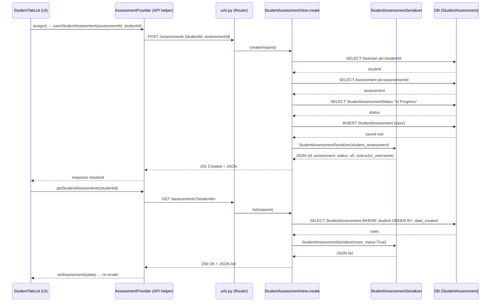

# Trace Notes (AI): assessments (learn-ops-api)

Traced flow: **assigning an assessment to a student** — the canonical write path
through `StudentAssessmentView`. An instructor selects an assessment from a dropdown
in the student tab UI, which POSTs to `/assessments`, creates a `StudentAssessment`
row, and the UI refetches the student's assessment list.

## Request Path

### Request path table from Claude

| Layer | File | Class / Function | What it does |
|-------|------|-----------------|--------------|
| UI dialog | learn-ops-client/src/components/people/StudentTabList.js | `StudentTabList` → `assign()` (line 52) | Instructor picks an assessment in the dropdown (`chosenAssessment`) and clicks Assign, calling `saveStudentAssessment(chosenAssessment, activeStudent.id)`. |
| API helper | learn-ops-client/src/components/assessments/AssessmentProvider.js | `saveStudentAssessment()` (line 100) | `fetchIt` POST to `${apiHost}/assessments` with body `{ studentId, assessmentId }`. |
| URL router | learn-ops-api/LearningPlatform/urls.py | `router.register(r'assessments', views.StudentAssessmentView, 'assessment')` (line 26) | DRF DefaultRouter maps `POST /assessments` to the viewset's `create`. |
| View | learn-ops-api/LearningAPI/views/student_assessment.py | `StudentAssessmentView.create()` (line 49, else branch line 92) | Since only `studentId`/`assessmentId` are sent (no name/sourceURL/objectives), takes the else branch: builds a `StudentAssessment`, sets status to "In Progress", saves it. Guarded by `StudentAssessmentPermission` + `@is_instructor`. |
| Serializer | learn-ops-api/LearningAPI/views/student_assessment.py | `StudentAssessmentSerializer` (line 187) | Serializes the saved row to JSON: `id`, nested `assessment`, `status` (method field), `url`, `instructor_username` (method field). |
| DB | learn-ops-api/LearningAPI/models/people/student_assessment.py | `StudentAssessment` model | `INSERT` into the student-assessment table; FKs to `NssUser` (student), `Assessment`, `StudentAssessmentStatus`. `unique_together (student, assessment)` prevents duplicates. |
| UI refresh | learn-ops-client/src/components/assessments/AssessmentProvider.js | `getStudentAssessments()` (line 14) | After POST resolves, `StudentTabList.assign()` calls `getStudentAssessments(activeStudent.id)` → GET `/assessments?studentId=` → `setAssessments(data)` re-renders the list. |

### DB queries noted

- `NssUser.objects.get(pk=studentId)` — lookup student (SELECT).
- `Assessment.objects.get(pk=assessmentId)` — lookup assessment (SELECT).
- `StudentAssessmentStatus.objects.get(status="In Progress")` — lookup default status (SELECT).
- `student_assessment.save()` — INSERT into student-assessment table.
- Refresh path: `StudentAssessment.objects.filter(student=...).order_by('-date_created')` — list query (SELECT).

> ⚠️ Note: `StudentAssessmentSerializer.get_instructor_username` reads `obj.instructor.user.username`, but `create` never sets `instructor`. The model allows `instructor=null`, so serializing a freshly-created row raises `AttributeError: 'NoneType' object has no attribute 'user'` — this is the logged ERROR at the bottom of `student_assessment.py`.

## Sequence Diagram

### Sequence Diagram

